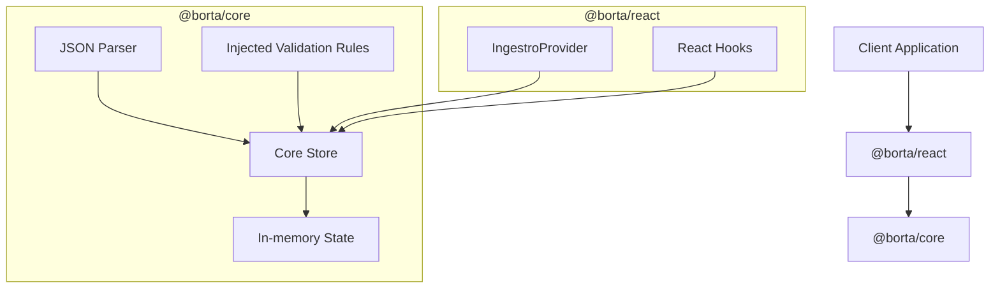

# Ingestro SDK Design Document

## Overview

Ingestro is a lightweight SDK for importing, reviewing, and correcting tabular data. It provides the primitives for building spreadsheet-like interfaces without coupling to a specific UI framework.

The SDK is split into two packages:
- `@borta/core`: Framework-agnostic parsing, state management, and validation.
- `@borta/react`: A thin React adapter (Provider + hooks).

### Focus Area: SDK & API Design Quality

I chose **Option B — SDK & API Design Quality** for this case study.

My goal was to design a Core API that is small, explicit, and hard to misuse. Instead of maximizing features, I focused on making the fundamental primitives—parsing, state access, and updates—predictable.

The Core store abstracts data loading, cell updates, and subscriptions into a single validatable flow. This allows the SDK to feel like an evented data source rather than a complex state machine.

Validation is integrated directly into the update flow. By executing validation within `loadData` and `updateCell`, the store guarantees that data and error states stay in sync.

## Architectural Intent

The primary architectural goal is strict separation between business logic and UI.

All logic for identifying columns, normalizing rows, tracking edits, and validating values lives in `@borta/core`. The `@borta/react` package contains **no business logic**.

This ensures validation behavior is identical regardless of the consuming framework and makes the Core easy to test in isolation.

## High-level Architecture



Everything feeds into or reacts to the Core store.

## Data Model

Imported data is normalized into a tabular structure:
- **Columns**: Discovery-based. Added in the order keys are first seen.
- **Rows**: Heterogeneous. Missing values are treated as empty cells.
- **Errors**: One validation error per cell.

```typescript
type CellValue = string | number | boolean | null;

interface DataRow {
  id: string;
  data: Record<string, CellValue>;
  errors?: Record<string, string>;
}

interface ParsedData {
  columns: ColumnDefinition[];
  rows: DataRow[];
}
```

## Core Store and State Management

The store is a custom, observer-based implementation. We avoid external state libraries to ensure the Core remains **framework agnostic** and bundle-size efficient.

For the full decision context, see **[ADR-003: Core State Management Strategy](./ADR-003-state-management.md)**.

**Key properties:**
- **Immutable Snapshots**: `getData()` returns a snapshot. All mutations must go through `updateCell`.
- **Integrated Validation**: Every update runs validation logic immediately.

## Validation Model

Validation rules are **injected** at runtime rather than hardcoded. This allows the consumer to define "validity" (e.g., specific email formats or SKU logic) while the Core generic manages the execution.

For details on why we chose injection, see **[ADR-001: Validation Strategy](./ADR-001-validation-injection.md)**.
For details on how rules are composed, see **[ADR-004: Validator Composition](./ADR-004-validator-composition.md)**.

## React Integration

`@borta/react` is an adapter. It exposes the store via `IngestroProvider` and provides hooks like `useIngestroData` to trigger re-renders on store updates.

It does not perform validation or parsing. It simply renders the current state and dispatches user actions to the Core.

## Trade-offs and Future Directions

- **Full Re-renders**: currently, `useIngestroData` triggers a re-render on any store change. For strict performance on large datasets, selector-based subscriptions would be the next optimization.
- **Cell-level focus**: Validation is currently optimized for single cells. Cross-row validation would require a new mechanism.
- **Virtualization**: Not implemented in the demo, but supported by the architecture (since the store is separate from the view).
